# ElasticSearch概述

## 是什么

> ElasticSearch是一个分布式、RESTful风格的搜索和数据分析引擎，能够解决不断涌现出的各种用例。作为ElasticStack的核心，它能集中存储数据，帮助发现意外情况

The Elastic Stack, 包括 Elasticsearch、Kibana、Beats 和 Logstash（也称为 ELK Stack）。能够安全可靠地获取任何来源、任何格式的数据，然后实时地对数据进行搜索、分析和可视化。Elaticsearch，简称为 ES，

ES 是一个**开源的高扩展的分布式全文搜索引擎**，是整个 ElasticStack 技术栈的核心。它可以近乎实时的存储、检索数据；本身扩展性很好，可以扩展到上百台服务器，处理 PB 级别的数据。

## 全文搜索引擎

Google，百度类的网站搜索，它们都是根据网页中的关键字生成索引，我们在搜索的时候输入关键字，它们会将该关键字即索引匹配到的所有网页返回；还有常见的项目中应用日志的搜索等等。对于这些非结构化的数据文本，关系型数据库搜索不是能很好的支持。

一般传统数据库，全文检索都实现的很鸡肋，因为一般也没人用数据库存文本字段。进行全文检索需要扫描整个表，如果数据量大的话即使对 SQL 的语法优化，也收效甚微。建立了索引，但是维护起来也很麻烦，对于 insert 和 update 操作都会重新构建索引。

基于以上原因可以分析得出，在一些生产环境中，使用常规的搜索方式，性能是非常差的：

1. 搜索的数据对象是大量的非结构化的文本数据。
2. 文件记录量达到数十万或数百万个甚至更多。
3. 支持大量基于交互式文本的查询。
4. 需求非常灵活的全文搜索查询。
5. 对高度相关的搜索结果的有特殊需求，但是没有可用的关系数据库可以满足。
6. 对不同记录类型、非文本数据操作或安全事务处理的需求相对较少的情况。为了解决结构化数据搜索和非结构化数据搜索性能问题，我们就需要专业，健壮，强大的全文搜索引擎

这里说到的全文搜索引擎指的是目前广泛应用的主流搜索引擎。它的工作原理是计算机索引程序通过扫描文章中的每一个词，对每一个词建立一个索引，指明该词在文章中出现的次数和位置，当用户查询时，检索程序就根据事先建立的索引进行查找，并将查找的结果反馈给用户的检索方式。这个过程类似于通过字典中的检索字表查字的过程。

## Elasticsearch And Solr

Lucene 是 Apache 软件基金会 Jakarta 项目组的一个子项目，提供了一个简单却强大的应用程式接口，能够做全文索引和搜寻。在 Java 开发环境里 Lucene 是一个成熟的免费开源工具。就其本身而言，Lucene 是当前以及最近几年最受欢迎的免费 Java 信息检索程序库。但 Lucene 只是一个提供全文搜索功能类库的核心工具包，而真正使用它还需要一个完善的服务框架搭建起来进行应用。

目前市面上流行的搜索引擎软件，主流的就两款：Elasticsearch 和 Solr,这两款都是基于 Lucene 搭建的，可以独立部署启动的搜索引擎服务软件。由于内核相同，所以两者除了服务器安装、部署、管理、集群以外，对于数据的操作 修改、添加、保存、查询等等都十分类似。

在使用过程中，一般都会将 Elasticsearch 和 Solr 这两个软件对比，然后进行选型。这两个搜索引擎都是流行的，先进的的开源搜索引擎。它们都是围绕核心底层搜索库 - Lucene构建的 - 但它们又是不同的。像所有东西一样，每个都有其优点和缺点：

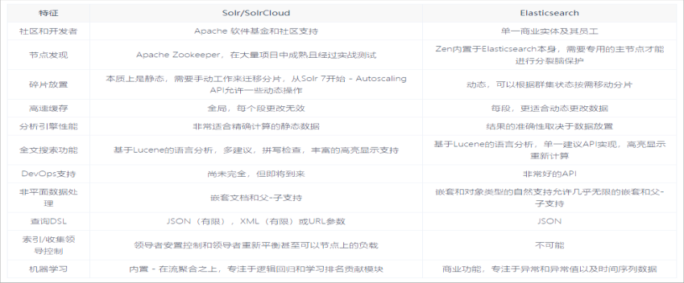

## Elasticsearch Or Solr

> Elasticsearch 和 Solr 都是开源搜索引擎，那么我们在使用时该如何选择呢？

* Google 搜索趋势结果表明，与 Solr 相比，Elasticsearch 具有很大的吸引力，但这并不意味着 Apache Solr 已经死亡。虽然有些人可能不这么认为，但 Solr 仍然是最受欢迎的搜索引擎之一，拥有强大的社区和开源支持。
* 与 Solr 相比，Elasticsearch 易于安装且非常轻巧。此外，你可以在几分钟内安装并运行Elasticsearch。但是，如果 Elasticsearch 管理不当，这种易于部署和使用可能会成为一个问题。基于 JSON 的配置很简单，但如果要为文件中的每个配置指定注释，那么它不适合您。总的来说，如果你的应用使用的是 JSON，那么 Elasticsearch 是一个更好的选择。否则，请使用 Solr，因为它的 schema.xml 和 solrconfig.xml 都有很好的文档记录。
* Solr 拥有更大，更成熟的用户，开发者和贡献者社区。ES 虽拥有的规模较小但活跃的用户社区以及不断增长的贡献者社区。Solr 贡献者和提交者来自许多不同的组织，而 Elasticsearch 提交者来自单个公司。
* Solr 更成熟，但 ES 增长迅速，更稳定。
* Solr 是一个非常有据可查的产品，具有清晰的示例和 API 用例场景。 Elasticsearch 的文档组织良好，但它缺乏好的示例和清晰的配置说明。

有时很难找到明确的答案。无论选择 Solr 还是 Elasticsearch，首先需要了解正确的用例和未来需求。总结他们的每个属性

* 由于易于使用，Elasticsearch 在新开发者中更受欢迎。一个下载和一个命令就可以启动一切。
* 如果除了搜索文本之外还需要它来处理分析查询，Elasticsearch 是更好的选择
* 如果需要分布式索引，则需要选择 Elasticsearch。对于需要良好可伸缩性和以及性能分布式环境，Elasticsearch 是更好的选择
* Elasticsearch 在开源日志管理用例中占据主导地位，许多组织在 Elasticsearch 中索引它们的日志以使其可搜索
* 如果你喜欢监控和指标，那么请使用 Elasticsearch，因为相对于 Solr，Elasticsearch 暴露了更多的关键指标

# ElasticSearch入门

## 数据格式

Elasticsearch 是面向文档型数据库，一条数据在这里就是一个文档。为了方便大家理解，我们将 Elasticsearch 里存储文档数据和关系型数据库 MySQL 存储数据的概念进行一个类比

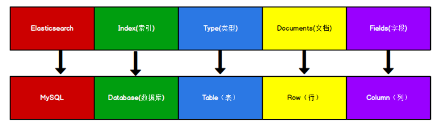

ES 里的 Index 可以看做一个库，而 Types 相当于表，Documents 则相当于表的行。这里 Types 的概念已经被逐渐弱化，Elasticsearch 6.X 中，一个 index 下已经只能包含一个type，Elasticsearch 7.X 中, Type 的概念已经被删除了。

## HTTP操作

> 索引操作

### 1. 创建索引

对比关系型数据库，创建索引就等同于创建数据库

在 Postman 中，向 ES 服务器发 PUT 请求 ：http://127.0.0.1:9200/shopping

请求后，服务器返回响应

```json
{
    "acknowledged"【响应结果】: true, # true 操作成功
    "shards_acknowledged"【分片结果】: true, # 分片操作成功
    "index"【索引名称】: "shopping"
}
```

### 2. 获取索引

> 获取某个索引

只需要把put改成get请求即可

响应结果：

```json
{
    "shopping"【索引名】: {
        "aliases"【别名】: {},
        "mappings"【映射】: {},
        "settings"【设置】: {
            "index"【设置 - 索引】: {
                "creation_date"【设置 - 索引 - 创建时间】: "1614265373911",
                "number_of_shards"【设置 - 索引 - 主分片数量】: "1",
                "number_of_replicas"【设置 - 索引 - 副分片数量】: "1",
                "uuid"【设置 - 索引 - 唯一标识】: "eI5wemRERTumxGCc1bAk2A",
                "version"【设置 - 索引 - 版本】: {
                	"created": "7080099"
                },
                "provided_name"【设置 - 索引 - 名称】: "shopping"
            }
        }
    }
}
```


> 获取所有索引

向 ES 服务器发 GET 请求 ：http://127.0.0.1:9200/_cat/indices?v

这里请求路径中的_cat 表示查看的意思，indices 表示索引，所以整体含义就是查看当前 ES服务器中的所有索引，就好像 MySQL 中的 show tables 的感觉，响应请求如下：


|      表头      |                             含义                             |
| :------------: | :----------------------------------------------------------: |
|     health     | 当前服务器健康状态：<br/>green(集群完整) yellow(单点正常、集群不完整) red(单点不正常) |
|     status     |                      索引打开、关闭状态                      |
|     index      |                            索引名                            |
|      uuid      |                         索引统一编号                         |
|      pri       |                          主分片数量                          |
|      rep       |                           副本数量                           |
|   docs.count   |                         可用文档数量                         |
|  docs.deleted  |                   文档删除状态（逻辑删除）                   |
|   store.size   |                 主分片和副分片整体占空间大小                 |
| pri.store.size |                       主分片占空间大小                       |

### 3. 删除索引

发送delete请求，并且带上索引字段名即可

## 文档操作

### 1. 创建文档

索引已经创建好了，接下来我们来创建文档，并添加数据。这里的文档可以类比为关系型数据库中的表数据，添加的数据格式为 JSON 格式

在 Postman 中，向 ES 服务器发 POST 请求 ：http://127.0.0.1:9200/shopping/_doc

请求体内容为：

```json
{
    "title":"小米手机",
    "category":"小米",
    "price":3999.00
}
```

**注意：请求体必须有，而且是json格式，并且请求必须为POST，这代表着文档内容**

服务器响应结果如下：

```json
{
    "_index"【索引】: "shopping",
    "_type"【 类型-文档 】: "_doc",
    "_id"【唯一标识】: "Xhsa2ncBlvF_7lxyCE9G", #可以类比为 MySQL 中的主键，随机生成
    "_version"【版本】: 1,
    "result"【结果】: "created", #这里的 create 表示创建成功
    "_shards"【分片】: {
        "total"【分片 - 总数】: 2,
        "successful"【分片 - 成功】: 1,
        "failed"【分片 - 失败】: 0
    },
    "_seq_no": 0,
    "_primary_term": 1
}
```

上面的数据创建后，由于没有指定数据唯一性标识（ID），默认情况下，ES 服务器会随机生成一个。

如果想要自定义唯一性标识，需要在创建时指定：http://127.0.0.1:9200/shopping/_doc/1

**此处需要注意：如果增加数据时明确数据主键，那么请求方式也可以为 PUT**

### 2. 查看文档

查看文档时，需要指明文档的唯一性标识，类似于 MySQL 中数据的主键查询

在 Postman 中，向 ES 服务器发 GET 请求 ：http://127.0.0.1:9200/shopping/_doc/1

```json
{
    "_index"【索引】: "shopping",
    "_type"【文档类型】: "_doc",
    "_id": "1",
    "_version": 2,
    "_seq_no": 2,
    "_primary_term": 2,
    "found"【查询结果】: true, # true 表示查找到，false 表示未查找到
        "_source"【文档源信息】: {
        "title": "华为手机",
        "category": "华为",
        "price": 4999.00
    }
}
```

### 3. 修改文档

和新增文档一样，输入相同的 URL 地址请求，如果请求体变化，会将原有的数据内容覆盖在 Postman 中，向 ES 服务器发 POST 请求 ：http://127.0.0.1:9200/shopping/_doc/1

```json
{
    "_index": "shopping",
    "_type": "_doc",
    "_id": "1",
    "_version"【版本】: 2,
    "result"【结果】: "updated", # updated 表示数据被更新
    "_shards": {
        "total": 2,
        "successful": 1,
        "failed": 0
    },
    "_seq_no": 2,
    "_primary_term": 2
}
```

### 4. 修改字段

修改数据时，也可以只修改某一给条数据的局部信息

在 Postman 中，向 ES 服务器发 POST 请求 ：http://127.0.0.1:9200/shopping/_update/1

```json
{
    "doc": {
    	"price":3000.00
    }
}
```

### 5. 删除文档

删除一个文档不会立即从磁盘上移除，它只是被标记成已删除（逻辑删除）。

在 Postman 中，向 ES 服务器发 DELETE 请求 ：http://127.0.0.1:9200/shopping/_doc/1

```json
{
    "_index": "shopping",
    "_type": "_doc",
    "_id": "1",
    "_version"【版本】: 4, #对数据的操作，都会更新版本
    "result"【结果】: "deleted", # deleted 表示数据被标记为删除
    "_shards": {
        "total": 2,
        "successful": 1,
        "failed": 0
    },
    "_seq_no": 4,
    "_primary_term": 2
}
```

### 6. 条件查询，分页查询

向ES服务器发送请求: http://127.0.0.1:9200/shopping/_search

```json
{
    # 条件查询开始
    "query": {
        "match": {
            "category": "小米"
        }
    },
    # 分页开始
    "from": 0, # 第几条
    "size": 1, # 要几条
	"source": ["title"], # 指定想要哪些数据
	"sort": {
        "price": {
            "order": "desc" # 排序，升序
        }
    }
}
```

即可查询到`category`为`小米`的数据

## 映射操作

有了索引库，等于有了数据库中的 database。

接下来就需要建索引库(index)中的映射了，类似于数据库(database)中的表结构(table)。创建数据库表需要设置字段名称，类型，长度，约束等；索引库也一样，需要知道这个类型下有哪些字段，每个字段有哪些约束信息，这就叫做映射(mapping)。

### 1. 创建映射

向 ES 服务器发 PUT 请求 ：http://127.0.0.1:9200/xx/_mapping，请求的内容为：

```json
{
    "properties": {
        "name":{
            "type": "text",
            "index": true
        },
        "sex":{
            "type": "keyword",
            "index": false
        },
        "age":{
            "type": "keyword",
            "index": false
        }
    }
}
```

映射数据说明

* 字段名：任意填写，下面指定许多属性，例如：title、subtitle、images、price

* type：类型，Elasticsearch 中支持的数据类型非常丰富，说几个关键的：

  * String 类型，又分两种：
    * text：可分词
    * keyword：不可分词，数据会作为完整字段进行匹配
  * Numerical：数值类型，分两类
    * 基本数据类型：long、integer、short、byte、double、float、half_float
    * 浮点数的高精度类型：scaled_float
  * Date：日期类型
  * Array：数组类型
  * Object：对象

* index：是否索引，默认为 true，也就是说你不进行任何配置，所有字段都会被索引。

  * true：字段会被索引，则可以用来进行搜索
  * false：字段不会被索引，不能用来搜索

* store：是否将数据进行独立存储，默认为 false

  原始的文本会存储在source 里面，默认情况下其他提取出来的字段都不是独立存储的，是从source 里面提取出来的。当然你也可以独立的存储某个字段，只要设置`"store": true` 即可，获取独立存储的字段要比从_source 中解析快得多，但是也会占用更多的空间，所以要根据实际业务需求来设置。

* analyzer：分词器，这里的 ik_max_word 即使用 ik 分词器,后面会有专门的章节学习

### 2. 查看映射

向 ES 服务器发 GET 请求 ：http://127.0.0.1:9200/xx/_mapping

### 3. 索引映射关联

向 ES 服务器发 PUT 请求 ：http://127.0.0.1:9200/xx，body如下

```json
{
    "settings": {},
    "mappings": {
        "properties": {
            "name":{
                "type": "text",
                "index": true
            },
            "sex":{
                "type": "text",
                "index": false
            },
            "age":{
                "type": "long",
                "index": false
            }
        }
    }
}
```

## 高级查询

Elasticsearch 提供了基于 JSON 提供完整的查询 DSL 来定义查询

### 1. 查询所有文档

向 ES 服务器发 GET 请求 ：http://127.0.0.1:9200/xx/_search

```json
{
    "query": {
        "match_all": {}
    }
}
# "query"：这里的 query 代表一个查询对象，里面可以有不同的查询属性
# "match_all"：查询类型，例如：match_all(代表查询所有)， match，term ， range 等等
# {查询条件}：查询条件会根据类型的不同，写法也有差异
```

### 2. 字段匹配查询

multi_match 与 match 类似，不同的是它可以在多个字段中查询。

向 ES 服务器发 GET 请求 ：http://127.0.0.1:9200/xx/_search

```json
{
    "query": {
        "multi_match": {
            "query": "zhangsan",
            "fields": ["name","nickname"]
        }
    }
}
```

### 3. 关键字精确查询

term 查询，精确的关键词匹配查询，不对查询条件进行分词。

向 ES 服务器发 GET 请求 ：http://127.0.0.1:9200/xx/_search

```json
{
    "query": {
        "term": {
            "name": {
            	"value": "zhangsan"
            }
        }
    }
}
```

### 4. 多关键字精确查询

terms 查询和 term 查询一样，但它允许你指定多值进行匹配。

如果这个字段包含了指定值中的任何一个值，那么这个文档满足条件，类似于 mysql 的 in

向 ES 服务器发 GET 请求 ：http://127.0.0.1:9200/xx/_search

```json
{
    "query": {
        "terms": {
        	"name": ["zhangsan","lisi"]
        }
    }
}
```

### 5. 指定查询字段

默认情况下，Elasticsearch 在搜索的结果中，会把文档中保存在_source 的所有字段都返回。

如果我们只想获取其中的部分字段，我们可以添加_source 的过滤

向 ES 服务器发 GET 请求 ：http://127.0.0.1:9200/xx/_search

```json
{
    "_source": ["name","nickname"],
    "query": {
        "terms": {
        	"nickname": ["zhangsan"]
        }
    }
}
```

### 6. 过滤字段

我们也可以通过

* includes：来指定想要显示的字段
* excludes：来指定不想要显示的字段

向 ES 服务器发 GET 请求 ：http://127.0.0.1:9200/xx/_search

```json
{
    "_source": {
    	"includes": ["name","nickname"]
    },
    "query": {
        "terms": {
        	"nickname": ["zhangsan"]
        }
    }
}
```

### 7. 组合查询

`bool`把各种其它查询通过`must`（必须 ）、`must_not`（必须不）、`should`（应该）的方式进行组合

在 Postman 中，向 ES 服务器发 GET 请求 ：http://127.0.0.1:9200/xx/_search

```json
{
    "query": {
        "bool": {
            "must": [
                {
                    "match": {
                        "name": "zhangsan"
                    }
                }
            ],
            "must_not": [
                {
                    "match": {
                        "age": "40"
                    }
                }
            ],
            "should": [
                {
                    "match": {
                        "sex": "男"
                    }
                }
            ]
        }
    }
}
```

### 8. 范围查询

range 查询找出那些落在指定区间内的数字或者时间。range 查询允许以下字符

| 操作符 | 说明 |
| :----: | :--: |
|   gt   |  >   |
|  gte   |  >=  |
|   lt   |  <   |
|  lte   |  <=  |

向 ES 服务器发 GET 请求 ：http://127.0.0.1:9200/xx/_search

```json
{
    "query": {
        "range": {
            "age": {
                "gte": 30,
                "lte": 35
            }
        }
    }
}
```

### 9. 模糊查询

返回包含与搜索字词相似的字词的文档。

编辑距离是将一个术语转换为另一个术语所需的一个字符更改的次数。这些更改可以包括：

* 更改字符（box → fox）
* 删除字符（black → lack）
* 插入字符（sic → sick）
* 转置两个相邻字符（act → cat）

为了找到相似的术语，fuzzy 查询会在指定的编辑距离内创建一组搜索词的所有可能的变体或扩展。然后查询返回每个扩展的完全匹配。

通过 fuzziness 修改编辑距离。一般使用默认值 AUTO，根据术语的长度生成编辑距离。

向 ES 服务器发 GET 请求 ：http://127.0.0.1:9200/xx/_search

```json
{
    "query": {
        "fuzzy": {
            "title": {
            	"value": "zhangsan"
            }
        }
    }
}
```

```json
{
    "query": {
        "fuzzy": {
            "title": {
                "value": "zhangsan",
                "fuzziness": 2
            }
        }
    }
}
```

### 10. 聚合查询

聚合允许使用者对 es 文档进行统计分析，类似与关系型数据库中的 group by，当然还有很多其他的聚合，例如取最大值、平均值等等。

向 ES 服务器发 GET 请求 ：http://127.0.0.1:9200/xx/_search

> 对某个字段取最大值 max

```json
{
    "aggs":{
        "max_age":{
            "max":{"field":"age"}
        }
    },
    "size":0
}
```

> 对某个字段求和 sum

```json
{
    "aggs":{
        "sum_age":{
            "sum":{"field":"age"}
        }
    },
    "size":0
}
```

# Elasticsearch  环境

## 相关概念

### 1. 单机 &  集群

单台 Elasticsearch 服务器提供服务，往往都有最大的负载能力，超过这个阈值，服务器性能就会大大降低甚至不可用，所以生产环境中，一般都是运行在指定服务器集群中。

除了负载能力，单点服务器也存在其他问题：

* 单台机器存储容量有限
* 单服务器容易出现单点故障，无法实现高可用
* 单服务的并发处理能力有限

配置服务器集群时，集群中节点数量没有限制，大于等于 2 个节点就可以看做是集群了。一般出于高性能及高可用方面来考虑集群中节点数量都是 3 个以上。

### 2. 集群 Cluster

一个集群就是由一个或多个服务器节点组织在一起，共同持有整个的数据，并一起提供索引和搜索功能。一个 Elasticsearch 集群有一个唯一的名字标识，这个名字默认就是”elasticsearch”。这个名字是重要的，因为一个节点只能通过指定某个集群的名字，来加入这个集群。

### 3. 节点 Node

集群中包含很多服务器，一个节点就是其中的一个服务器。作为集群的一部分，它存储数据，参与集群的索引和搜索功能。

一个节点也是由一个名字来标识的，默认情况下，这个名字是一个随机的漫威漫画角色的名字，这个名字会在启动的时候赋予节点。这个名字对于管理工作来说挺重要的，因为在这个管理过程中，你会去确定网络中的哪些服务器对应于 Elasticsearch 集群中的哪些节点。

一个节点可以通过配置集群名称的方式来加入一个指定的集群。默认情况下，每个节点都会被安排加入到一个叫做“elasticsearch”的集群中，这意味着，如果你在你的网络中启动了若干个节点，并假定它们能够相互发现彼此，它们将会自动地形成并加入到一个叫做“elasticsearch”的集群中。

在一个集群里，只要你想，可以拥有任意多个节点。而且，如果当前你的网络中没有运行任何 Elasticsearch 节点，这时启动一个节点，会默认创建并加入一个叫做“elasticsearch”的集群。

## Windows 集群

### 1. 部署集群

1. 复制三个 elasticsearch 服务
2. 修改集群文件目录中每个节点的 config/elasticsearch.yml 配置文件

节点1

```yaml
#节点 1 的配置信息：
#集群名称，节点之间要保持一致
cluster.name: my-elasticsearch
#节点名称，集群内要唯一
node.name: node-1001
node.master: true
node.data: true

#ip 地址
network.host: localhost
#http 端口
http.port: 1001
#tcp 监听端口
transport.tcp.port: 9301

#discovery.seed_hosts: ["localhost:9301", "localhost:9302","localhost:9303"]
#discovery.zen.fd.ping_timeout: 1m
#discovery.zen.fd.ping_retries: 5
#集群内的可以被选为主节点的节点列表
#cluster.initial_master_nodes: ["node-1", "node-2","node-3"]

#跨域配置
#action.destructive_requires_name: true
http.cors.enabled: true
http.cors.allow-origin: "*"
```

节点2

```yaml
#节点 2 的配置信息：
#集群名称，节点之间要保持一致
cluster.name: my-elasticsearch
#节点名称，集群内要唯一
node.name: node-1002
node.master: true
node.data: true

#ip 地址
network.host: localhost
#http 端口
http.port: 1002
#tcp 监听端口
transport.tcp.port: 9302
discovery.seed_hosts: ["localhost:9301"]
discovery.zen.fd.ping_timeout: 1m
discovery.zen.fd.ping_retries: 5

#集群内的可以被选为主节点的节点列表
#cluster.initial_master_nodes: ["node-1", "node-2","node-3"]

#跨域配置
#action.destructive_requires_name: true
http.cors.enabled: true
http.cors.allow-origin: "*"
```

节点3

```yaml
#节点 3 的配置信息：
#集群名称，节点之间要保持一致
cluster.name: my-elasticsearch
#节点名称，集群内要唯一
node.name: node-1003
node.master: true
node.data: true

#ip 地址
network.host: localhost
#http 端口
http.port: 1003
#tcp 监听端口
transport.tcp.port: 9303

#候选主节点的地址，在开启服务后可以被选为主节点
discovery.seed_hosts: ["localhost:9301", "localhost:9302"]
discovery.zen.fd.ping_timeout: 1m
discovery.zen.fd.ping_retries: 5

#集群内的可以被选为主节点的节点列表
#cluster.initial_master_nodes: ["node-1", "node-2","node-3"]

#跨域配置
#action.destructive_requires_name: true
http.cors.enabled: true
http.cors.allow-origin: "*"
```

### 2. 启动集群

1. 启动前先删除每个节点中的 data 目录中所有内容（如果存在）
2. 分别双击执行 bin/elasticsearch.bat, 启动节点服务器，启动后，会自动加入指定名称的集群

查看集群的运行状态

向ES服务器发送GET请求: http://localhost:1001/_cluster/health

其中`status`字段指示当前集群在总体上是否运行正常，三种颜色含义如下

* `green` 所有主分片和副分片都正常运行
* `yellow` 所有主分片都正常运行，但不是所有副分片也都正常运行
* `red` 有主分片没能正常运行

## Linux 集群

### 1. 下载软件并解压，分发到其他节点

### 2. 创建用户

因为安全问题，Elasticsearch 不允许 root 用户直接运行，所以要在每个节点中创建新用户，在 root 用户中创建新用户

```bash
useradd es #新增 es 用户
passwd es #为 es 用户设置密码

userdel -r es #如果错了，可以删除再加
chown -R es:es es-cluster #后面的文件夹名，改变文件夹所有者
```

### 3. 修改配置文件

修改config/elasticsearch.yml 文件，分发文件

```yaml
#集群名称
cluster.name: cluster-es
#节点名称，每个节点的名称不能重复
node.name: node-1
#ip 地址，每个节点的地址不能重复

#是否有资格主节点
node.master: true
node.data: true
http.port: 9200

# head 插件需要这打开这两个配置
http.cors.allow-origin: "*"
http.cors.enabled: true
http.max_content_length: 200mb

#es7.x 之后新增的配置，初始化一个新的集群时需要此配置来选举 master
cluster.initial_master_nodes: ["node-1"]
#es7.x 之后新增的配置，节点发现
discovery.seed_hosts: ["linux1:9300","linux2:9300","linux3:9300"]
gateway.recover_after_nodes: 2
network.tcp.keep_alive: true
network.tcp.no_delay: true
transport.tcp.compress: true

#集群内同时启动的数据任务个数，默认是 2 个
cluster.routing.allocation.cluster_concurrent_rebalance: 16
#添加或删除节点及负载均衡时并发恢复的线程个数，默认 4 个
cluster.routing.allocation.node_concurrent_recoveries: 16
#初始化数据恢复时，并发恢复线程的个数，默认 4 个
cluster.routing.allocation.node_initial_primaries_recoveries: 16
```

修改/etc/security/limits.conf ，分发文件

```bash
# 在文件末尾中增加下面内容
es soft nofile 65536
es hard nofile 65536
```

修改/etc/security/limits.d/20-nproc.conf，分发文件

```bash
# 在文件末尾中增加下面内容
es soft nofile 65536
es hard nofile 65536
* hard nproc 4096
# 注：* 代表 Linux 所有用户名称
```

修改/etc/sysctl.conf

```bash
# 在文件中增加下面内容
vm.max_map_count=655360
```

重新加载

```bash
sysctl -p
```

# ElasticSearch 进阶

## 核心概念

### 1. 索引（index)

一个索引就是一个拥有几分相似特征的文档的集合。比如说，你可以有一个客户数据的索引，另一个产品目录的索引，还有一个订单数据的索引。一个索引由一个名字来标识（必须全部是小写字母），并且当我们要对这个索引中的文档进行索引、搜索、更新和删除的时候，都要使用到这个名字。在一个集群中，可以定义任意多的索引。

能搜索的数据必须索引，这样的好处是可以提高查询速度，比如：新华字典前面的目录就是索引的意思，目录可以提高查询速度。

**Elasticsearch  索引的精髓：一切设计都是为了提高搜索的性能**

### 2. 类型（Type)

在一个索引中，你可以定义一种或多种类型。

一个类型是你的索引的一个逻辑上的分类/分区，其语义完全由你来定。通常，会为具有一组共同字段的文档定义一个类型。不同的版本，类型发生了不同的变化

**7.x版本以后已不再支持**

### 3. 文档（Document）

一个文档是一个可被索引的基础信息单元，也就是一条数据

比如：你可以拥有某一个客户的文档，某一个产品的一个文档，当然，也可以拥有某个订单的一个文档。文档以 JSON（Javascript Object Notation）格式来表示，而 JSON 是一个到处存在的互联网数据交互格式。

在一个 index/type 里面，你可以存储任意多的文档。

### 4. 字段（Field）

相当于是数据表的字段，对文档数据根据不同属性进行的分类标识。

### 5. 映射（Mapping)

mapping 是处理数据的方式和规则方面做一些限制，如：某个字段的数据类型、默认值、分析器、是否被索引等等。这些都是映射里面可以设置的，其它就是处理 ES 里面数据的一些使用规则设置也叫做映射，按着最优规则处理数据对性能提高很大，因此才需要建立映射，并且需要思考如何建立映射才能对性能更好

### 6. 分片（Shards)

一个索引可以存储超出单个节点硬件限制的大量数据。比如，一个具有 10 亿文档数据的索引占据 1TB 的磁盘空间，而任一节点都可能没有这样大的磁盘空间。或者单个节点处理搜索请求，响应太慢。

为了解决这个问题，Elasticsearch 提供了将索引划分成多份的能力，每一份就称之为分片。当你创建一个索引的时候，你可以指定你想要的分片的数量。每个分片本身也是一个功能完善并且独立的“索引”，这个“索引”可以被放置到集群中的任何节点上。

分片很重要，主要有两方面的原因：

1. 允许你水平分割 / 扩展你的内容容量。
2. 允许你在分片之上进行分布式的、并行的操作，进而提高性能/吞吐量。

至于一个分片怎样分布，它的文档怎样聚合和搜索请求，是完全由 Elasticsearch 管理的，对于作为用户的你来说，这些都是透明的，无需过分关心。

**被混淆的概念是，一个 Lucene 索引我们在 Elasticsearch 称作分片  。  一个 Elasticsearch 索引是分片的集合。当 Elasticsearch 在索引中搜索的时候，他发送查询到每一个属于索引的分片(Lucene索引)，然后合并每个分片的结果到一个全局的结果集**

### 7. 副本（Replicas）

在一个网络 / 云的环境里，失败随时都可能发生，在某个分片/节点不知怎么的就处于离线状态，或者由于任何原因消失了，这种情况下，有一个故障转移机制是非常有用并且是强烈推荐的。为此目的，Elasticsearch 允许你创建分片的一份或多份拷贝，这些拷贝叫做复制分片(副本)。

复制分片之所以重要，有两个主要原因：

1. 在分片/节点失败的情况下，提供了高可用性。因为这个原因，注意到复制分片从不与原/主要（original/primary）分片置于同一节点上是非常重要的。
2. 扩展你的搜索量/吞吐量，因为搜索可以在所有的副本上并行运行。

总之，每个索引可以被分成多个分片。一个索引也可以被复制 0 次（意思是没有复制）或多次。一旦复制了，每个索引就有了主分片（作为复制源的原来的分片）和复制分片（主分片的拷贝）之别。

分片和复制的数量可以在索引创建的时候指定。在索引创建之后，你可以在任何时候动态地改变复制的数量，但是你事后不能改变分片的数量。

默认情况下，Elasticsearch 中的每个索引被分片 1 个主分片和 1 个复制，这意味着，如果你的集群中至少有两个节点，你的索引将会有 1 个主分片和另外 1 个复制分片（1 个完全拷贝），这样的话每个索引总共就有 2 个分片，我们需要根据索引需要确定分片个数。

### 8. 分配（Allocation）

将分片分配给某个节点的过程，包括分配主分片或者副本。如果是副本，还包含从主分片复制数据的过程。这个过程是由 master 节点完成的

## 系统架构

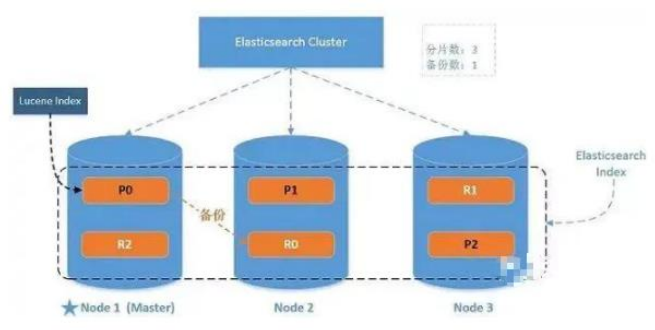

一个运行中的 Elasticsearch 实例称为一个节点，而集群是由一个或者多个拥有相同cluster.name 配置的节点组成， 它们共同承担数据和负载的压力。当有节点加入集群中或者从集群中移除节点时，集群将会重新平均分布所有的数据。

当一个节点被选举成为主节点时， 它将负责管理集群范围内的所有变更，例如增加、删除索引，或者增加、删除节点等。 而主节点并不需要涉及到文档级别的变更和搜索等操作，所以当集群只拥有一个主节点的情况下，即使流量的增加它也不会成为瓶颈。 任何节点都可以成为主节点。我们的示例集群就只有一个节点，所以它同时也成为了主节点。

作为用户，我们可以将请求发送到集群中的任何节点 ，包括主节点。 每个节点都知道任意文档所处的位置，并且能够将我们的请求直接转发到存储我们所需文档的节点。 无论我们将请求发送到哪个节点，它都能负责从各个包含我们所需文档的节点收集回数据，并将最终结果返回給客户端。 Elasticsearch 对这一切的管理都是透明的。

## 分布式集群

### 1. 单节点集群

我们在包含一个空节点的集群内创建名为 users 的索引，分配 3个主分片和一份副本（每个主分片拥有一个副本分片）

```json
{
    "settings" : {
        "number_of_shards" : 3,
        "number_of_replicas" : 1
    }
}
```

我们的集群现在是拥有一个索引的单节点集群。所有 3 个主分片都被分配在 node-1

通过 elasticsearch-head 插件查看集群情况

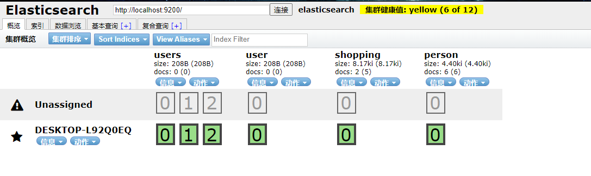

集群健康值:`yellow( 3 of 6 )` : 表示当前集群的全部主分片都正常运行，但是副本分片没有全部处在正常状态

所以当前我们的集群是正常运行的，但是在硬件故障时有丢失数据的风险

### 2. 故障转移

当集群中只有一个节点在运行时，意味着会有一个单点故障问题——没有冗余。 幸运的是，我们只需再启动一个节点即可防止数据丢失。当你在同一台机器上启动了第二个节点时，只要它和第一个节点有同样的 cluster.name 配置，它就会自动发现集群并加入到其中。但是在不同机器上启动节点的时候，为了加入到同一集群，你需要配置一个可连接到的单播主机列表。之所以配置为使用单播发现，以防止节点无意中加入集群。只有在同一台机器上运行的节点才会自动组成集群。

如果启动了第二个节点，我们的集群将会拥有两个节点的集群 : 所有主分片和副本分片都已被分配

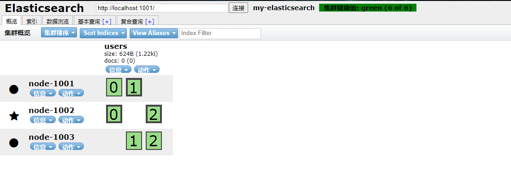

### 3. 水平扩容

怎样为我们的正在增长中的应用程序按需扩容呢？当启动了第三个节点，我们的集群将会拥有三个节点的集群 : 为了分散负载而对分片进行重新分配

**但是如果我们想要扩容超过6个节点怎么办呢？**

主分片的数目在索引创建时就已经确定了下来。实际上，这个数目定义了这个索引能够存储 的最大数据量。（实际大小取决于你的数据、硬件和使用场景。） 但是，读操作——搜索和返回数据——可以同时被主分片 或 副本分片所处理，所以当你拥有越多的副本分片时，也将拥有越高的吞吐量。

在运行中的集群上是可以动态调整副本分片数目的，我们可以按需伸缩集群。让我们把副本数从默认的 1 增加到 2

向ES服务器发送PUT请求到http://127.0.0.1:1001/users/_settings

```json
{
	"number_of_replicas" : 2
}
```

效果如下

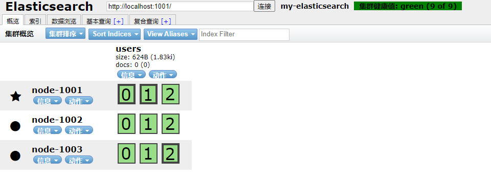

当然，如果只是在相同节点数目的集群上增加更多的副本分片并不能提高性能，因为每个分片从节点上获得的资源会变少。 你需要增加更多的硬件资源来提升吞吐量。但是更多的副本分片数提高了数据冗余量：按照上面的节点配置，我们可以在失去 2 个节点的情况下不丢失任何数据。

### 4. 路由计算

当索引一个文档的时候，文档会被存储到一个主分片中。 Elasticsearch 如何知道一个文档应该存放到哪个分片中呢？当我们创建文档时，它如何决定这个文档应当被存储在分片1 还是分片 2 中呢？首先这肯定不会是随机的，否则将来要获取文档的时候我们就不知道从何处寻找了。实际上，这个过程是根据下面这个公式决定的：

**shard = hash(routing) % number_of_primary_shards​**

routing 是一个可变值，默认是文档的 _id ，也可以设置成一个自定义的值。 routing 通过hash 函数生成一个数字，然后这个数字再除以 number_of_primary_shards （主分片的数量）后得到余数 。这个分布在 0 到 number_of_primary_shards-1 之间的余数，就是我们所寻求的文档所在分片的位置。

这就解释了为什么我们要在创建索引的时候就确定好主分片的数量 并且永远不会改变这个数量：因为如果数量变化了，那么所有之前路由的值都会无效，文档也再也找不到了。

所有的文档 API（ get 、 index 、 delete 、 bulk 、 update 以及 mget ）都接受一个叫做 routing 的路由参数 ，通过这个参数我们可以自定义文档到分片的映射。一个自定义的路由参数可以用来确保所有相关的文档——例如所有属于同一个用户的文档——都被存储到同一个分片中。

## 分片控制

我们假设有一个集群由三个节点组成。 它包含一个叫 emps 的索引，有三个主分片，每个主分片有两个副本分片。相同分片的副本不会放在同一节点。

我们可以发送请求到集群中的任一节点。 每个节点都有能力处理任意请求。 每个节点都知道集群中任一文档位置，所以可以直接将请求转发到需要的节点上。**而被访问且要进行转发的节点，我们将其称为  协调节点(coordinating node)**

### 1. 写数据流程

新建、索引和删除请求都是写操作， 必须在主分片上面完成之后才能被复制到相关的副本分片

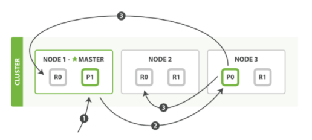

**新建，索引和删除文档所需要的步骤顺序如下**

1. 客户端向 Node 1 发送新建、索引或者删除请求。
2. 节点使用文档的 _id 确定文档属于分片 0 。请求会被转发到 Node 3，因为分片 0 的主分片目前被分配在 Node 3 上。
3. Node 3 在主分片上面执行请求。如果成功了，它将请求并行转发到 Node 1 和 Node 2的副本分片上。一旦所有的副本分片都报告成功, Node 3 将向协调节点报告成功，协调节点向客户端报告成功。

在客户端收到成功响应时，文档变更已经在主分片和所有副本分片执行完成，变更是安全的。有一些可选的请求参数允许您影响这个过程，可能以数据安全为代价提升性能。这些选项很少使用，因为 Elasticsearch 已经很快，但是为了完整起见，请参考下面表格：

|    参数     |                             说明                             |
| :---------: | :----------------------------------------------------------: |
| consistency | consistency，即一致性。在默认设置下，即使仅仅是在试图执行一个_写_操作之前，主分片都会要求 必须要有 规定数量(quorum)（或者换种说法，也即必须要有大多数）的分片副本处于活跃可用状态，才会去执行_写_操作(其中分片副本可以是主分片或者副本分片)。这是为了避免在发生网络分区故障（networkpartition）的时候进行_写_操作，进而导致数据不一致。_规定数量_即：<br />**int( (primary + number_of_replicas) / 2 ) + 1**<br />consistency 参数的值可以设为 one （只要主分片状态 ok 就允许执行_写_操<作）,all（必须要主分片和所有副本分片的状态没问题才允许执行_写_操作）, 或quorum 。默认值为 quorum , 即大多数的分片副本状态没问题就允许执行_写_操作。<br />注意，规定数量 的计算公式中 number_of_replicas 指的是在索引设置中的设定副本分片数，而不是指当前处理活动状态的副本分片数。如果你的索引设置中指定了当前索引拥有三个副本分片，那规定数量的计算结果即：<br />**int( (primary + 3 replicas) / 2 ) + 1 = 3**<br />如果此时你只启动两个节点，那么处于活跃状态的分片副本数量就达不到规定数量，也因此您将无法索引和删除任何文档。 |
|   timeout   | 如果没有足够的副本分片会发生什么？ Elasticsearch 会等待，希望更多的分片出现。默认情况下，它最多等待 1 分钟。 如果你需要，你可以使用 timeout 参数使它更早终止： 100 100 毫秒，30s 是 30 秒。 |

新索引默认有 1 个副本分片，这意味着为满足规定数量应该需要两个活动的分片副本。 但是，这些默认的设置会阻止我们在单一节点上做任何事情。为了避免这个问题，要求只有当 number_of_replicas 大于 1 的时候，规定数量才会执行。

### 2. 读数据流程

我们可以从主分片或者从其它任意副本分片检索文档

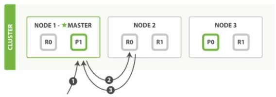

**从主分片或者副本分片检索文档的步骤顺序如下：**

1. 客户端向 Node 1 发送获取请求。
2. 节点使用文档的 _id 来确定文档属于分片 0 。分片 0 的副本分片存在于所有的三个节点上。 在这种情况下，它将请求转发到 Node 2 。
3. Node 2 将文档返回给 Node 1 ，然后将文档返回给客户端。

在处理读取请求时，协调结点在每次请求的时候都会通过轮询所有的副本分片来达到负载均衡。在文档被检索时，已经被索引的文档可能已经存在于主分片上但是还没有复制到副本分片。 在这种情况下，副本分片可能会报告文档不存在，但是主分片可能成功返回文档。 一旦索引请求成功返回给用户，文档在主分片和副本分片都是可用的。

### 3. 更新数据流程

部分更新一个文档结合了先前说明的读取和写入流程：

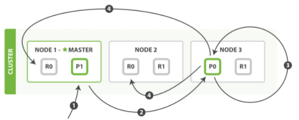

**部分更新一个文档的步骤**

1. 客户端向 Node 1 发送更新请求。
2. 它将请求转发到主分片所在的 Node 3 。
3. Node 3 从主分片检索文档，修改 _source 字段中的 JSON ，并且尝试重新索引主分片的文档。 如果文档已经被另一个进程修改，它会重试步骤 3 ，超过 retry_on_conflict 次后放弃
4. 如果 Node 3 成功地更新文档，它将新版本的文档并行转发到 Node 1 和 Node 2 上的副本分片，重新建立索引。一旦所有副本分片都返回成功， Node 3 向协调节点也返回成功，协调节点向客户端返回成功

> 当主分片把更改转发到副本分片时， 它不会转发更新请求。 相反，它转发完整文档的新版本。请记住，这些更改将会异步转发到副本分片，并且不能保证它们以发送它们相同的顺序到达。 如果 Elasticsearch 仅转发更改请求，则可能以错误的顺序应用更改，导致得到损坏的文档。

### 4. 分片原理

分片是 Elasticsearch 最小的工作单元。但是究竟什么是一个分片，它是如何工作的？

传统的数据库每个字段存储单个值，但这对全文检索并不够。文本字段中的每个单词需要被搜索，对数据库意味着需要单个字段有索引多值的能力。最好的支持是一个字段多个值需求的数据结构是**倒排索引**。

### 5. 倒排索引

Elasticsearch 使用一种称为**倒排索引**的结构，它适用于快速的全文搜索。

见其名，知其意，有倒排索引，肯定会对应有正向索引。正向索引（forward index），反向索引（inverted index）更熟悉的名字是倒排索引。

所谓的正向索引，就是搜索引擎会将待搜索的文件都对应一个文件 ID，搜索时将这个ID 和搜索关键字进行对应，形成 K-V 对，然后对关键字进行统计计数

但是互联网上收录在搜索引擎中的文档的数目是个天文数字，这样的索引结构根本无法满足实时返回排名结果的要求。所以，搜索引擎会将正向索引重新构建为倒排索引，即把文件ID对应到关键词的映射转换为关键词到文件ID的映射，每个关键词都对应着一系列的文件，这些文件中都出现这个关键词。

一个倒排索引由文档中所有不重复词的列表构成，对于其中每个词，有一个包含它的文档列表。例如，假设我们有两个文档，每个文档的 content 域包含如下内容：

* The quick brown fox jumped over the lazy dog
* Quick brown foxes leap over lazy dogs in summer

为了创建倒排索引，我们首先将每个文档的 content 域拆分成单独的词（我们称它为 词条或 tokens ），创建一个包含所有不重复词条的排序列表，然后列出每个词条出现在哪个文档。结果如下所示：


现在，如果我们想搜索 quick brown ，我们只需要查找包含每个词条的文档：


两个文档都匹配，但是第一个文档比第二个匹配度更高。如果我们使用仅计算匹配词条数量的简单相似性算法，那么我们可以说，对于我们查询的相关性来讲，第一个文档比第二个文档更佳。

但是，我们目前的倒排索引有一些问题：

* Quick 和 quick 以独立的词条出现，然而用户可能认为它们是相同的词。
* fox 和 foxes 非常相似, 就像 dog 和 dogs ；他们有相同的词根。
* jumped 和 leap, 尽管没有相同的词根，但他们的意思很相近。他们是同义词

使用前面的索引搜索 `+Quick` `+fox` 不会得到任何匹配文档。（记住，+ 前缀表明这个词必须存在。）只有同时出现 `Quick` 和 `fox` 的文档才满足这个查询条件，但是第一个文档包含`quick fox` ，第二个文档包含 `Quick foxes` 。

我们的用户可以合理的期望两个文档与查询匹配。我们可以做的更好。如果我们将词条规范为标准模式，那么我们可以找到与用户搜索的词条不完全一致，但具有足够相关性的文档。例如：

* Quick 可以小写化为 quick 。
* foxes 可以 词干提取 --变为词根的格式-- 为 fox 。类似的， dogs 可以为提取为 dog 。
* jumped 和 leap 是同义词，可以索引为相同的单词 jump 。

现在索引看上去像这样：

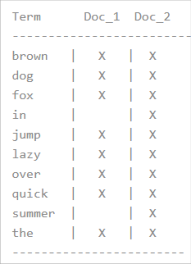

这还远远不够。我们搜索 +Quick +fox 仍然 会失败，因为在我们的索引中，已经没有 Quick了。但是，如果我们对搜索的字符串使用与 content 域相同的标准化规则，会变成查询+quick +fox，这样两个文档都会匹配！分词和标准化的过程称为**分析**

这非常重要。你只能搜索在索引中出现的词条，所以索引文本和查询字符串必须标准化为相同的格式

### 6. 文档搜索

早期的全文检索会为整个文档集合建立一个很大的倒排索引并将其写入到磁盘。 一旦新的索引就绪，旧的就会被其替换，这样最近的变化便可以被检索到。

倒排索引被写入磁盘后是 不可改变 的:它永远不会修改

不变性有重要的价值：

* 不需要锁。如果你从来不更新索引，你就不需要担心多进程同时修改数据的问题。
* 一旦索引被读入内核的文件系统缓存，便会留在哪里，由于其不变性。只要文件系统缓存中还有足够的空间，那么大部分读请求会直接请求内存，而不会命中磁盘。这提供了很大的性能提升。
* 其它缓存(像 filter 缓存)，在索引的生命周期内始终有效。它们不需要在每次数据改变时被重建，因为数据不会变化。
* 写入单个大的倒排索引允许数据被压缩，减少磁盘 I/O 和 需要被缓存到内存的索引的使用量。

当然，一个不变的索引也有不好的地方。主要事实是它是不可变的! 你不能修改它。如果你需要让一个新的文档 可被搜索，你需要重建整个索引。这要么对一个索引所能包含的数据量造成了很大的限制，要么对索引可被更新的频率造成了很大的限制。

### 7. 动态更新索引

如何在保留不变性的前提下实现倒排索引的更新？

答案是: 用更多的索引。通过增加新的补充索引来反映新近的修改，而不是直接重写整个倒排索引。每一个倒排索引都会被轮流查询到，从最早的开始查询完后再对结果进行合并。

Elasticsearch 基于 Lucene, 这个 java 库引入了**按段搜索**的概念。 每一 段本身都是一个倒排索引， 但索引在 Lucene 中除表示所有段的集合外， 还增加了提交点的概念 — 一个列出了所有已知段的文件

按段搜索会以如下流程执行：

1. 新文档被收集到内存索引缓存

   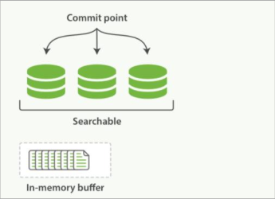

2. 不时地, 缓存被提交

   1. 一个新的段—一个追加的倒排索引—被写入磁盘。
   2. 一个新的包含新段名字的 提交点 被写入磁盘
   3. 磁盘进行 同步 — 所有在文件系统缓存中等待的写入都刷新到磁盘，以确保它们被写入物理文件

3. 新的段被开启，让它包含的文档可见以被搜索

4. 内存缓存被清空，等待接收新的文档

   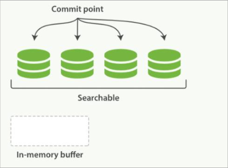

当一个查询被触发，所有已知的段按顺序被查询。词项统计会对所有段的结果进行聚合，以保证每个词和每个文档的关联都被准确计算。 这种方式可以用相对较低的成本将新文档添加到索引。

段是不可改变的，所以既不能从把文档从旧的段中移除，也不能修改旧的段来进行反映文档的更新。 取而代之的是，每个提交点会包含一个 .del 文件，文件中会列出这些被删除文档的段信息。

当一个文档被 “删除” 时，它实际上只是在 .del 文件中被 标记 删除。一个被标记删除的文档仍然可以被查询匹配到， 但它会在最终结果被返回前从结果集中移除。

文档更新也是类似的操作方式：当一个文档被更新时，旧版本文档被标记删除，文档的新版本被索引到一个新的段中。 可能两个版本的文档都会被一个查询匹配到，但被删除的那个旧版本文档在结果集返回前就已经被移除。

### 8. 近实时搜索，文档刷新， 刷写， 合并

主要流程图：

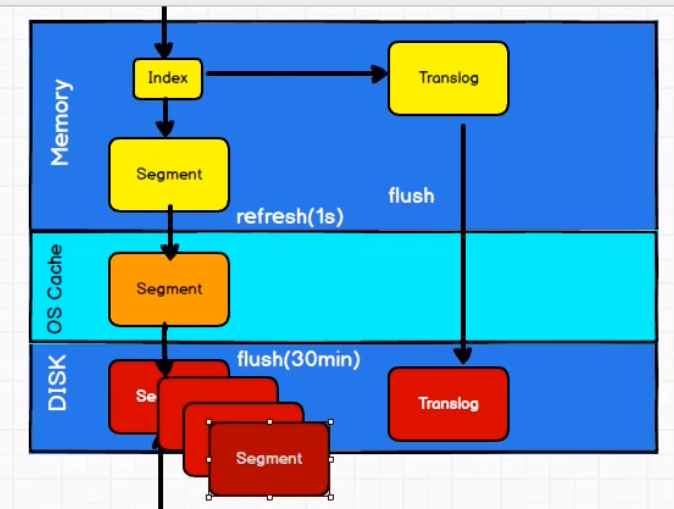

随着按段（per-segment）搜索的发展，一个新的文档从索引到可被搜索的延迟显著降低了。新文档在几分钟之内即可被检索，但这样还是不够快。磁盘在这里成为了瓶颈

这里引入了OS中间层，通过每秒刷新(refresh)实现近实时搜索，把数据存储到OS的内存缓冲区中，然后再持久化到磁盘里

我们仍然需要经常进行完整提交来确保能从失败中恢复。但在两次提交之间发生变化的文档怎么办？我们也不希望丢失掉这些数据。Elasticsearch 增加了一个 translog ，或者叫事务日志，在每一次对 Elasticsearch 进行操作时均进行了日志记录

整个流程如下：

1. 一个文档被索引之后，就会被添加到内存缓冲区，并且追加到了 translog
2. 刷新（refresh）使分片每秒被刷新（refresh）一次：
   * 这些在内存缓冲区的文档被写入到一个新的段中，且没有进行 fsync 操作。
   * 这个段被打开，使其可被搜索
   * 内存缓冲区被清空
3. 这个进程继续工作，更多的文档被添加到内存缓冲区和追加到事务日志
4. 每隔一段时间—例如 translog 变得越来越大—索引被刷新（flush）；一个新的 translog被创建，并且一个全量提交被执行
   * 所有在内存缓冲区的文档都被写入一个新的段。
   * 缓冲区被清空
   * 一个提交点被写入硬盘
   * 文件系统缓存通过 fsync 被刷新（flush）
   * 老的 translog 被删除

translog 提供所有还没有被刷到磁盘的操作的一个持久化纪录。当 Elasticsearch 启动的时候， 它会从磁盘中使用最后一个提交点去恢复已知的段，并且会重放 translog 中所有在最后一次提交后发生的变更操作。

translog 也被用来提供实时 CRUD 。当你试着通过 ID 查询、更新、删除一个文档，它会在尝试从相应的段中检索之前， 首先检查 translog 任何最近的变更。这意味着它总是能够实时地获取到文档的最新版本。

执行一个提交并且截断 translog 的行为在 Elasticsearch 被称作一次 flush分片每 30 分钟被自动刷新（flush），或者在 translog 太大的时候也会刷新

### 9. 段合并

由于自动刷新流程每秒会创建一个新的段 ，这样会导致短时间内的段数量暴增。而段数目太多会带来较大的麻烦。 每一个段都会消耗文件句柄、内存和 cpu 运行周期。更重要的是，每个搜索请求都必须轮流检查每个段；所以段越多，搜索也就越慢。Elasticsearch 通过在后台进行段合并来解决这个问题。小的段被合并到大的段，然后这些大的段再被合并到更大的段。

段合并的时候会将那些旧的已删除文档从文件系统中清除。被删除的文档（或被更新文档的旧版本）不会被拷贝到新的大段中。

启动段合并不需要你做任何事。进行索引和搜索时会自动进行。

1. 当索引的时候，刷新（refresh）操作会创建新的段并将段打开以供搜索使用。
2. 合并进程选择一小部分大小相似的段，并且在后台将它们合并到更大的段中。这并不会中断索引和搜索。
3. 一旦合并结束，老的段被删除
   * 新的段被刷新（flush）到了磁盘。 写入一个包含新段且排除旧的和较小的段的新提交点。
   * 新的段被打开用来搜索
   * 老的段被删除

合并大的段需要消耗大量的 I/O 和 CPU 资源，如果任其发展会影响搜索性能。Elasticsearch在默认情况下会对合并流程进行资源限制，所以搜索仍然 有足够的资源很好地执行

## 文档分析

分析 包含下面的过程：

1. 将一块文本分成适合于倒排索引的独立的词条

2. 将这些词条统一化为标准格式以提高它们的“可搜索性”，或者 recall分析器执行上面的工作。分析器实际上是将三个功能封装到了一个包里：

   * 字符过滤器

     首先，字符串按顺序通过每个 字符过滤器 。他们的任务是在分词前整理字符串。一个字符过滤器可以用来去掉 HTML，或者将 & 转化成 and。

   * 分词器

     其次，字符串被 分词器 分为单个的词条。一个简单的分词器遇到空格和标点的时候，可能会将文本拆分成词条。

   * Token 过滤器

     最后，词条按顺序通过每个 token 过滤器 。这个过程可能会改变词条（例如，小写化Quick ），删除词条（例如， 像 a， and， the 等无用词），或者增加词条（例如，像 jump和 leap 这种同义词）。

### 1. 内置分析器

Elasticsearch 还附带了可以直接使用的预包装的分析器。接下来我们会列出最重要的分析器。为了证明它们的差异，我们看看每个分析器会从下面的字符串得到哪些词条：

"Set the shape to semi-transparent by calling set_trans(5)"

> 标准分析器

标准分析器是 Elasticsearch 默认使用的分析器。它是分析各种语言文本最常用的选择。它根据 Unicode 联盟 定义的 单词边界 划分文本。删除绝大部分标点。最后，将词条小写。它会产生：

set, the, shape, to, semi, transparent, by, calling, set_trans, 5

> 简单分析器

简单分析器在任何不是字母的地方分隔文本，将词条小写。它会产生：

set, the, shape, to, semi, transparent, by, calling, set, trans

> 空格分析器

空格分析器在空格的地方划分文本。它会产生：

Set, the, shape, to, semi-transparent, by, calling, set_trans(5)

> 语言分析器

特定语言分析器可用于 很多语言。它们可以考虑指定语言的特点。例如， 英语 分析器附带了一组英语无用词（常用单词，例如 and 或者 the ，它们对相关性没有多少影响），它们会被删除。 由于理解英语语法的规则，这个分词器可以提取英语单词的 词干 。

英语 分词器会产生下面的词条：

set, shape, semi, transpar, call, set_tran, 5

注意看 transparent、 calling 和 set_trans 已经变为词根格式

### 2. 分析器使用场景

当我们索引一个文档，它的全文域被分析成词条以用来创建倒排索引。 但是，当我们在全文域 搜索 的时候，我们需要将查询字符串通过 相同的分析过程 ，以保证我们搜索的词条格式与索引中的词条格式一致

全文查询，理解每个域是如何定义的，因此它们可以做正确的事：

* 当你查询一个**全文**域时， 会对查询字符串应用相同的分析器，以产生正确的搜索词条列表
* 当你查询一个**精确值**域时，不会分析查询字符串，而是搜索你指定的精确值

### 3. 测试分析器

有些时候很难理解分词的过程和实际被存储到索引中的词条，特别是你刚接触Elasticsearch。为了理解发生了什么，你可以使用 analyze API 来看文本是如何被分析的。在消息体里，指定分析器和要分析的文本

向ES服务器发送GET请求: http://localhost:1001/_analyze

```json
{
    "analyzer": "standard",
    "text": "Text to analyze"
}
```

结果中的每个元素代表一个单独的词条

```json
{
    "tokens": [
        {
            "token": "text",
            "start_offset": 0,
            "end_offset": 4,
            "type": "<ALPHANUM>",
            "position": 0
        },
        {
            "token": "to",
            "start_offset": 5,
            "end_offset": 7,
            "type": "<ALPHANUM>",
            "position": 1
        },
        {
            "token": "analyze",
            "start_offset": 8,
            "end_offset": 15,
            "type": "<ALPHANUM>",
            "position": 2
        }
    ]
}
```

token 是实际存储到索引中的词条。

position 指明词条在原始文本中出现的位置。

start_offset 和 end_offset 指明字符在原始字符串中的位置。

### 4. 指定分析器

当Elasticsearch在你的文档中检测到一个新的字符串域，它会自动设置其为一个**全文字符串域**，使用**标准分析器**对它进行分析。

你不希望总是这样。可能你想使用一个不同的分析器，适用于你的数据使用的语言。有时候你想要一个字符串域就是一个字符串域—不使用分析，直接索引你传入的精确值，例如用户 ID 或者一个内部的状态域或标签。要做到这一点，我们必须手动指定这些域的映射。

### 5. IK 分词器

首先我们通过发送 GET 请求查询分词效果: http://localhost:1001/_analyze

```json
{
	"text":"测试单词"
}
```

ES 的默认分词器无法识别中文中测试、单词这样的词汇，而是简单的将每个字拆完分为一个词

这样的结果显然不符合我们的使用要求，所以我们需要下载 ES 对应版本的中文分词器

我们这里采用 IK 中文分词器，下载地址为:

https://github.com/medcl/elasticsearch-analysis-ik

将解压后的后的文件夹放入 ES 根目录下的 plugins 目录下，重启 ES 即可使用。

我们这次加入新的查询参数"analyzer": "ik_max_word"

```json
{
    "text":"测试单词",
    "analyzer":"ik_max_word"
}
```

* ik_max_word：会将文本做最细粒度的拆分
* ik_smart：会将文本做最粗粒度的拆分

ES 中也可以进行扩展词汇，例如我们想将"弗雷尔卓德"作为整个词语

首先进入 ES 根目录中的 plugins 文件夹下的 ik 文件夹，进入 config 目录，创建 custom.dic文件，写入弗雷尔卓德。同时打开 IKAnalyzer.cfg.xml 文件，将新建的 custom.dic 配置其中，重启 ES 服务器。

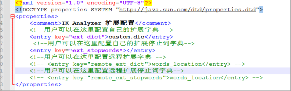

## 文档处理

### 1. 文档冲突

当我们使用 index API 更新文档 ，可以一次性读取原始文档，做我们的修改，然后重新索引 整个文档 。 最近的索引请求将获胜：无论最后哪一个文档被索引，都将被唯一存储在 Elasticsearch 中。如果其他人同时更改这个文档，他们的更改将丢失。

很多时候这是没有问题的。也许我们的主数据存储是一个关系型数据库，我们只是将数据复制到 Elasticsearch 中并使其可被搜索。 也许两个人同时更改相同的文档的几率很小。或者对于我们的业务来说偶尔丢失更改并不是很严重的问题。

但有时丢失了一个变更就是 非常严重的 。试想我们使用 Elasticsearch 存储我们网上商城商品库存的数量， 每次我们卖一个商品的时候，我们在 Elasticsearch 中将库存数量减少。有一天，管理层决定做一次促销。突然地，我们一秒要卖好几个商品。 假设有两个 web 程序并行运行，每一个都同时处理所有商品的销售

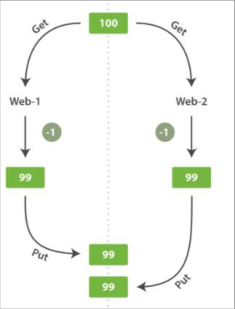

web_1 对 stock_count 所做的更改已经丢失，因为 web_2 不知道它的 stock_count 的拷贝已经过期。 结果我们会认为有超过商品的实际数量的库存，因为卖给顾客的库存商品并不存在，我们将让他们非常失望。

变更越频繁，读数据和更新数据的间隙越长，也就越可能丢失变更。

在数据库领域中，有两种方法通常被用来确保并发更新时变更不会丢失：

> 悲观并发控制

这种方法被关系型数据库广泛使用，它假定有变更冲突可能发生，因此阻塞访问资源以防止冲突。 一个典型的例子是读取一行数据之前先将其锁住，确保只有放置锁的线程能够对这行数据进行修改。

> 乐观并发控制

Elasticsearch 中使用的这种方法假定冲突是不可能发生的，并且不会阻塞正在尝试的操作。 然而，如果源数据在读写当中被修改，更新将会失败。应用程序接下来将决定该如何解决冲突。 例如，可以重试更新、使用新的数据、或者将相关情况报告给用户

### 2. 乐观并发控制

Elasticsearch 是分布式的。当文档创建、更新或删除时， 新版本的文档必须复制到集群中的其他节点。Elasticsearch 也是异步和并发的，这意味着这些复制请求被并行发送，并且到达目的地时也许 顺序是乱的 。 Elasticsearch 需要一种方法确保文档的旧版本不会覆盖新的版本。

当我们之前讨论 index ， GET 和 delete 请求时，我们指出每个文档都有一个 _version（版本）号，当文档被修改时版本号递增。 Elasticsearch 使用这个 version 号来确保变更以正确顺序得到执行。如果旧版本的文档在新版本之后到达，它可以被简单的忽略。

我们可以利用 version 号来确保 应用中相互冲突的变更不会导致数据丢失。我们通过指定想要修改文档的 version 号来达到这个目的。 如果该版本不是当前版本号，我们的请求将会失败。

老的版本 es 使用 version，但是新版本不支持了，会报下面的错误，提示我们用 if_seq_no和 if_primary_term

### 3. 外部系统版本控制

一个常见的设置是使用其它数据库作为主要的数据存储，使用 Elasticsearch 做数据检索， 这意味着主数据库的所有更改发生时都需要被复制到 Elasticsearch ，如果多个进程负责这一数据同步，你可能遇到类似于之前描述的并发问题。

如果你的主数据库已经有了版本号 — 或一个能作为版本号的字段值比如 timestamp —那么你就可以在 Elasticsearch 中通过增加 version_type=external 到查询字符串的方式重用这些相同的版本号， 版本号必须是大于零的整数， 且小于 9.2E+18 — 一个 Java 中 long类型的正值。

外部版本号的处理方式和我们之前讨论的内部版本号的处理方式有些不同，Elasticsearch 不是检查当前 _version 和请求中指定的版本号是否相同， 而是检查当前_version 是否 小于 指定的版本号。 如果请求成功，外部的版本号作为文档的新 _version进行存储。

外部版本号不仅在索引和删除请求是可以指定，而且在 创建 新文档时也可以指定

### 4. Kibana

Kibana 是一个免费且开放的用户界面，能够让你对 Elasticsearch 数据进行可视化，并让你在 Elastic Stack 中进行导航。你可以进行各种操作，从跟踪查询负载，到理解请求如何流经你的整个应用，都能轻松完成。

下载地址: https://github.com/elastic/kibana

1. 解压缩下载的 zip 文件
2. 修改 config/kibana.yml 文件

```yaml
# 默认端口
server.port: 5601
# ES 服务器的地址
elasticsearch.hosts: ["http://localhost:9200"]
# 索引名
kibana.index: ".kibana"
# 支持中文
i18n.locale: "zh-CN"
```

3. Windows 环境下执行 bin/kibana.bat 文件

# ElasticSearch 集成框架

## Spring Data 框架加成

### 1. Spring Data

Spring Data 是一个用于简化数据库、非关系型数据库、索引库访问，并支持云服务的开源框架。其主要目标是使得对数据的访问变得方便快捷，并支持 map-reduce 框架和云计算数据服务。

 Spring Data 可以极大的简化 JPA（Elasticsearch„）的写法，可以在几乎不用写实现的情况下，实现对数据的访问和操作。除了 CRUD 外，还包括如分页、排序等一些常用的功能。

Spring Data 的官网：https://spring.io/projects/spring-data

### 2. Spring Data Elasticsearch 介绍

Spring Data Elasticsearch 基于 spring data API 简化 Elasticsearch 操作，将原始操作Elasticsearch 的客户端 API 进行封装 。Spring Data 为 Elasticsearch 项目提供集成搜索引擎。Spring Data Elasticsearch POJO 的关键功能区域为中心的模型与 Elastichsearch 交互文档和轻松地编写一个存储索引库数据访问层。

官方网站: https://spring.io/projects/spring-data-elasticsearch

具体使用直接看代码即可

### 3. 